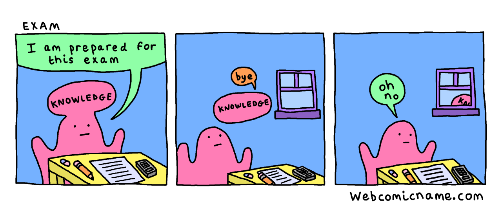

# Learning Abstractions

We have minds and the concepts needed exist in plenty of good resources. What is needed is learning abstractions, tools to solve the problem of moving those concepts from resources into memory.

What is an abstraction? According to the great programming book [CTMCP](https://www.info.ucl.ac.be/~pvr/book.html) an abstraction is a tool or device (or a strategem) that solves a particular problem. The problem that learning abstractions seek to solve is what I'm calling durable knowledge. My idea of durable knowledge is informed by Donald Norman's definition of learning as the "act of deliberate study of a specific body of material, so that the material can be retrieved at will and used with skill". Durable knowleged is available and useful.

